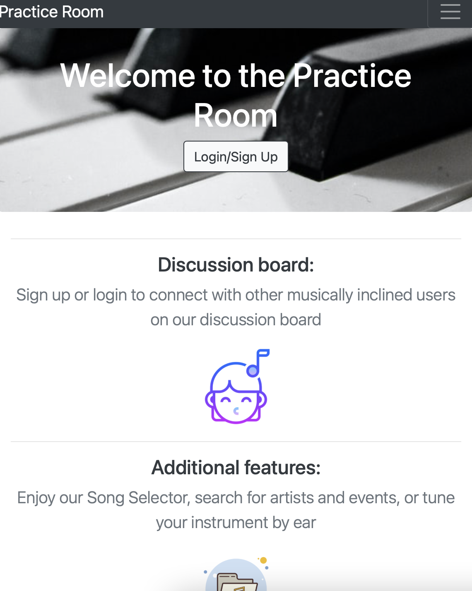
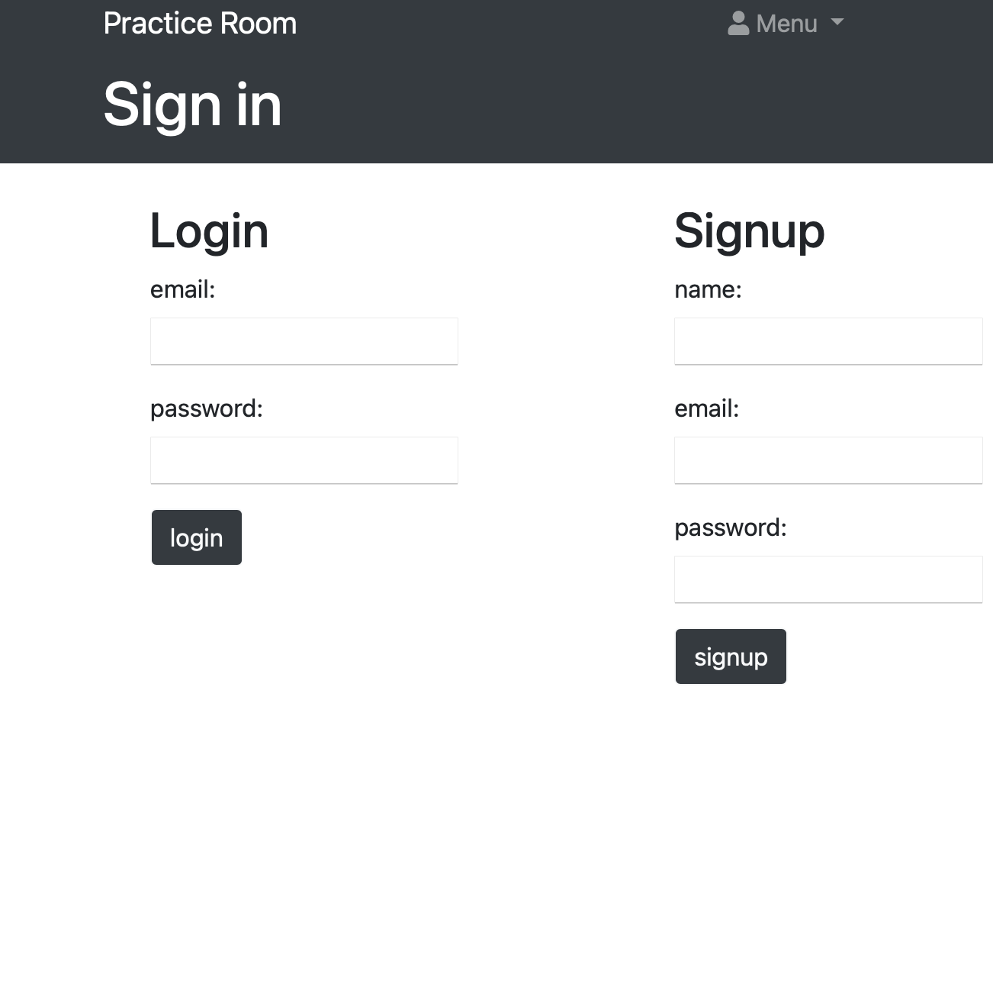
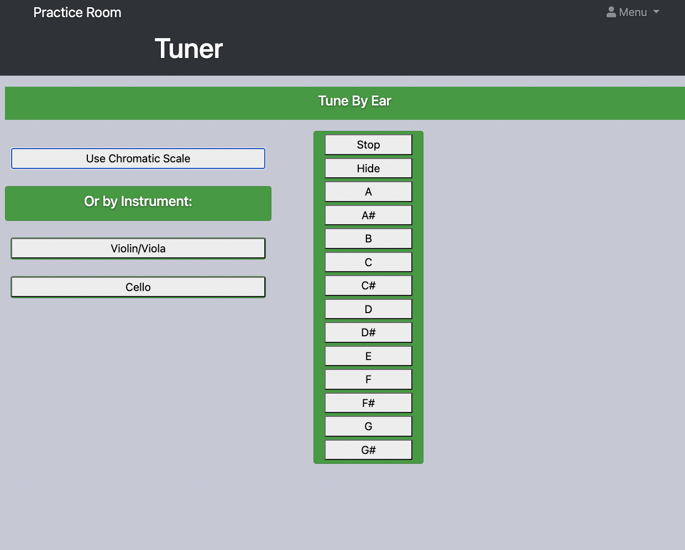
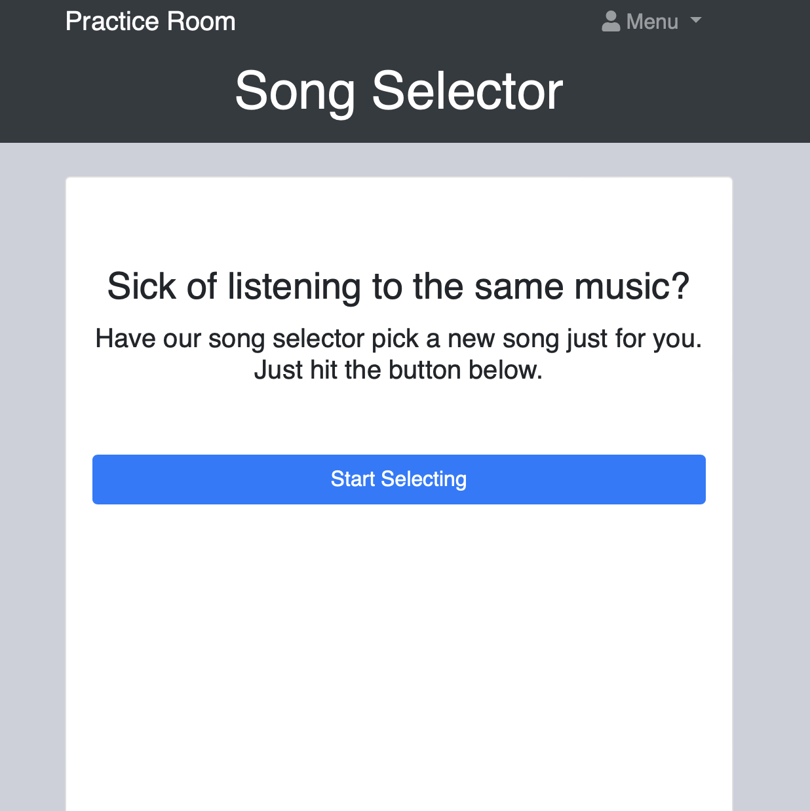
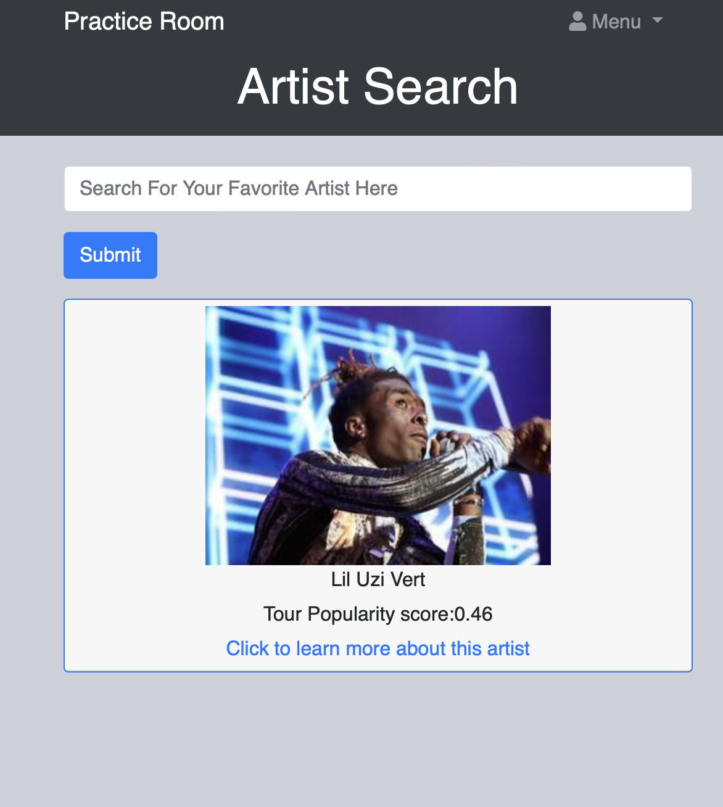

# Practice Room
## Description

This application is a resource/tool for music enthusiasts looking to post about music, find something new to listen to, or tune their instrument. 
Once signed in, the user has the ability to post messages, use the song selector, and the artist search feature.  The front end was created using HTML/CSS/Boostrap with Handlebars.js as the view engine. The back end was created with node.js and utilizes a mySQL database. 

[Deployed Application](http://tranquil-eyrie-98828.herokuapp.com/) 

## Features

* [bcrypt](https://www.npmjs.com/package/bcrypt)
* Tuner feature - tune by ear or by specific instrument
* Randomized song selector to discover new music
* Artist search feature powered by SeatGeek.com
* Discussion board to post with fellow users

---

## Table of contents

* [Screenshots](#screenshots)

* [Usage](#usage)

* [Contributors](#contributors)

* [How to Contribute](#how-to-contribute)

* [Links](#links)

* [References](#references)

---
## Screenshots

--- 

## Usage

Once signed up and signed in, user is redirected to the `posts` page where they are able to create/view posts. Clicking `menu` at the top right of the page will reveal a dropdown navbar to navigate through the site.

[Application deployed on Heroku](http://tranquil-eyrie-98828.herokuapp.com/) 

## Contributors

* [Elizabeth Berube](https://github.com/elizabethdberube)

* [Angela Donati](https://github.com/a-donati)

* [Marissa Flynn](https://github.com/ottercreektourism)

* [Reese Hartnett](https://github.com/pasfrad)

* [Michael Russiffilli](https://github.com/AllDeus)

## How to Contribute

To help add functionality, or for debugging/refactoring the code, please contact one of our team members to request access as a collaborator.

## Links

[Original GitHub Repo](https://github.com/AllDeus/PracticeRoom) 

[Forked Github Repo](https://github.com/a-donati/PracticeRoom)

[Deployed Application](http://tranquil-eyrie-98828.herokuapp.com/) 

# References 

[Passport.js](https://www.passportjs.org/)

[Handlebars.js](https://www.npmjs.com/package/handlebars)

[SeatGeek API](http://platform.seatgeek.com/)
